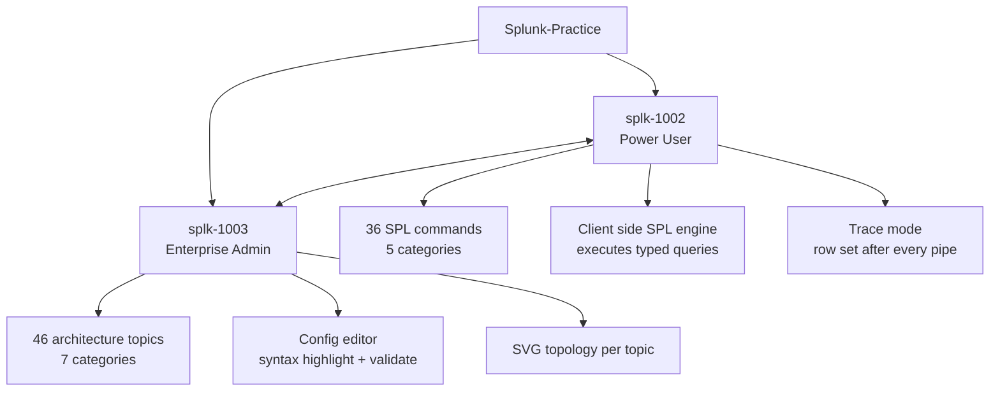
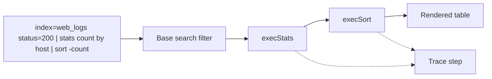
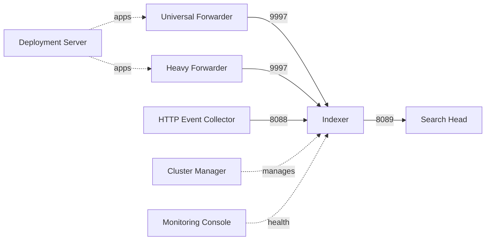
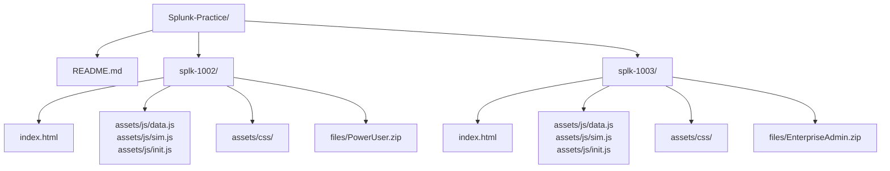
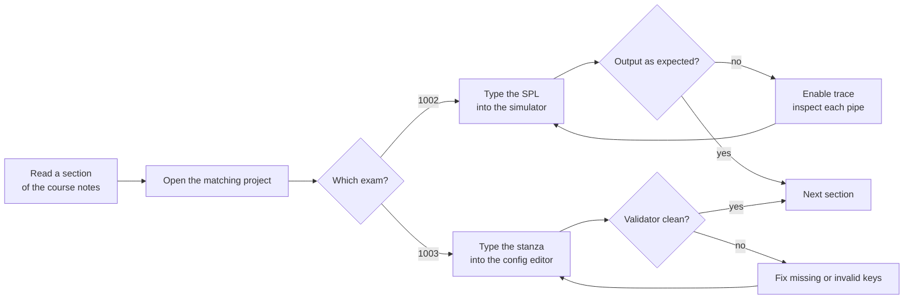

# Splunk-Practice

Two offline, browser based practice environments for the Splunk certification track. No Splunk instance, no license, no server, no build step. Clone the repo, open a folder, start practicing.

| Project | Certification | What it is |
| :--- | :--- | :--- |
| [`splk-1002`](./splk-1002) | SPLK-1002 Splunk Core Certified Power User | SPL reference with a working client side query engine |
| [`splk-1003`](./splk-1003) | SPLK-1003 Splunk Enterprise Certified Admin | Architecture and configuration reference with a `.conf` validator |

## Why This Exists

Both exams test skills that are normally earned on a live deployment. The Power User exam asks you to read an SPL pipeline and predict its output. The Admin exam asks you which component owns which `.conf` file, which stanza belongs where, and how two config layers resolve when they disagree.

Spinning up an indexer, a search head, and a pair of forwarders for every question is not practical. These two projects replace that with a model you can run from a static folder: a real SPL interpreter for the Power User side, and a browsable, validated architecture for the Admin side.



## splk-1002 : Splunk Quick Simulation

A synthetic event set plus an SPL engine written in plain JavaScript. Type a query, and it is parsed, split on pipes, and executed stage by stage against the in memory events. The output is a real rendered table, not a screenshot.



Around 45 executor functions cover aggregation, filtering, correlation, field extraction, and enrichment, backed by an expression evaluator for `eval` and `where`, a regex extractor for `rex`, CIDR matching, time bucketing with `span`, and multivalue handling.

Full details: [`splk-1002/README.md`](./splk-1002/README.md)

## splk-1003 : Splunk Admin Quick Reference

The full distributed deployment rebuilt as a browsable model. Each topic is one layer, shown with a rendered topology diagram, the real stanzas that configure it, the ports involved, and the exam facts attached to it. Typed `.conf` content is highlighted and checked against Splunk rules.



Full details: [`splk-1003/README.md`](./splk-1003/README.md)

## Getting Started

```bash
git clone https://github.com/qays3/Splunk-Practice.git
cd Splunk-Practice
```

Serve either project as a static site:

```bash
cd splk-1002
python3 -m http.server 8080
```

Then open `http://localhost:8080`. Swap `splk-1002` for `splk-1003` to run the Admin reference. Opening `index.html` directly from disk also works, since neither project has runtime dependencies.

## Repository Layout



| Path | Contents |
| :--- | :--- |
| `splk-1002/files/PowerUser.zip` | Power User course notes in Markdown, two quick reference PDFs, domain diagram |
| `splk-1003/files/EnterpriseAdmin.zip` | Enterprise Admin course notes and `Lab/Setup.md`, a walkthrough for building the practice deployment on real hosts |

Both projects link to each other from their navigation bar, so you can move between the SPL simulator and the architecture reference without leaving the browser.

## Suggested Study Loop



## Author

qays9 : [qayssarayra.com](https://qayssarayra.com)
