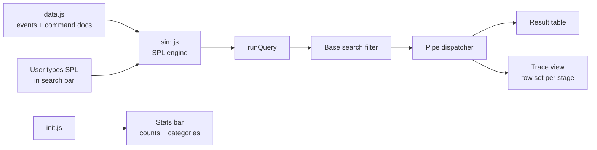
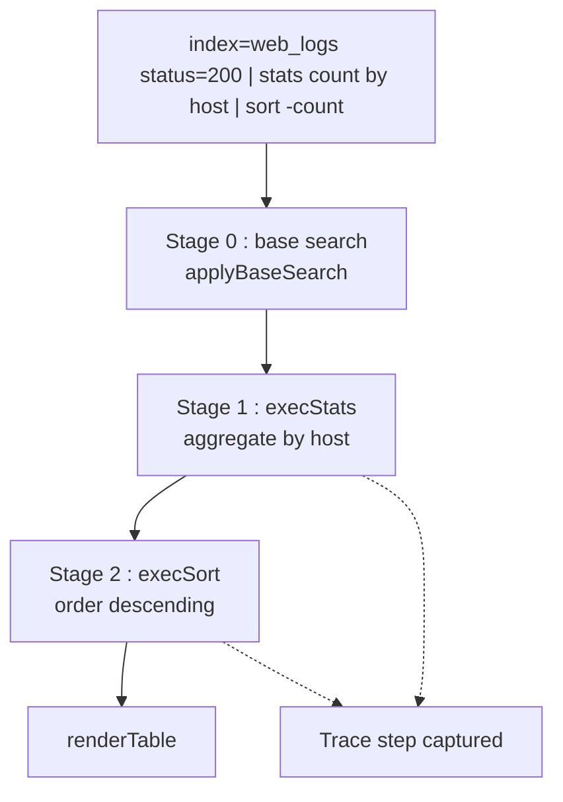
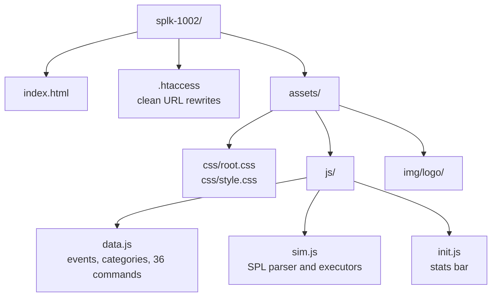

# splk-1002 : Splunk Quick Simulation

Interactive SPL practice environment for the **SPLK-1002 Splunk Core Certified Power User** exam.

## Project Purpose

The Power User exam tests whether you can read an SPL pipeline and predict its output. Reading command documentation does not build that skill, and standing up a real Splunk instance for every practice query is slow.

This project removes the instance. It ships a synthetic event dataset and a **client side SPL engine written in plain JavaScript** that actually parses and executes the query you type, pipe by pipe, and renders the resulting table. No server, no license, no install. Open `index.html` and the search bar works.

It serves three jobs at once:

| Role | What it does |
| :--- | :--- |
| Reference | 36 SPL commands with syntax, options, arguments, and exam tips |
| Simulator | Executes typed SPL against 27 in memory events and renders real output |
| Trainer | Trace mode shows the row set after every pipe so you see how the pipeline mutates data |

## How It Works



## Query Execution Model

Every query is split on the pipe character. The first segment filters the event set, and each following segment is dispatched to a dedicated executor function that transforms the working row set.



Around 45 executor functions are implemented, covering aggregation, filtering, correlation, field extraction, and enrichment. Supporting logic includes an expression evaluator for `eval` and `where`, a regex extractor for `rex`, CIDR matching, time bucketing with `span`, multivalue handling, and subsearch style appends.

## Command Coverage

| Category | Commands |
| :--- | :--- |
| Transforming | stats, chart, timechart, top, rare, eventstats, streamstats, bin, gauge, xyseries, untable, tstats, datamodel, metadata, makeresults |
| Filtering | search, where, regex, dedup, head, reverse, sort, fillnull |
| Correlating | transaction, append, appendcols, join |
| Field Extraction | rex, eval, strcat |
| Enrichment | lookup, inputlookup, outputlookup, table, fields, rename |

Each command page exposes: description, syntax examples, option matrix, exam tips, and a preset query you can load straight into the simulator.

## File Layout



| Path | Contents |
| :--- | :--- |
| `assets/js/data.js` | Synthetic event set, category definitions, and the full command knowledge base |
| `assets/js/sim.js` | Tokenizer, base search filter, executor dispatch, table renderer, trace renderer, live feed |
| `assets/js/init.js` | Builds the header stats bar from the data file |
| `.htaccess` | Extensionless URL routing for Apache hosting |

## Running It

Static site. No build step and no dependencies.

```bash
git clone https://github.com/qays3/Splunk-Practice.git
cd Splunk-Practice/splk-1002
python3 -m http.server 8080
```

Then open `http://localhost:8080`. Opening `index.html` directly from disk also works.

## Course Notes

The **Course Notes** button opens the full written Power User course, published at:

https://qayssarayra.com/vault/post/splunk-power-user-course

The notes are chaptered by exam domain and every SPL example in them runs in this simulator.

## Related

`../splk-1003` is the Enterprise Admin counterpart, an architecture and configuration file reference with a `.conf` validator.

## Repository

https://github.com/qays3/Splunk-Practice
