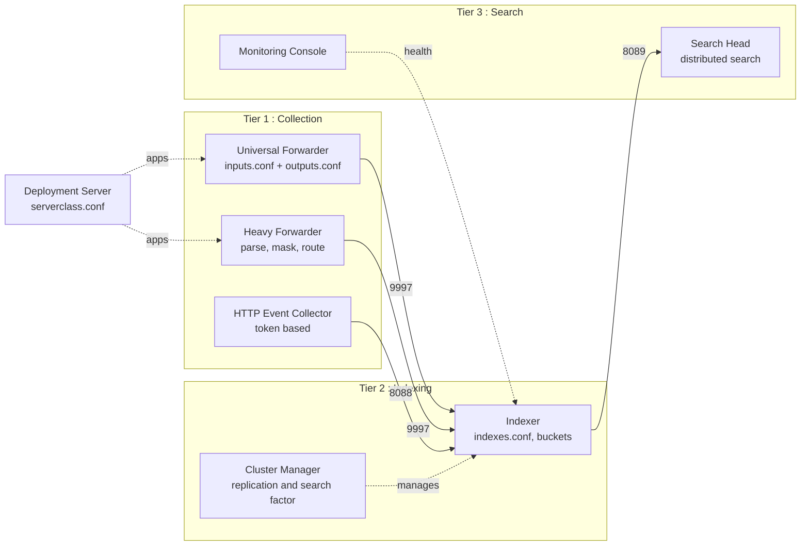
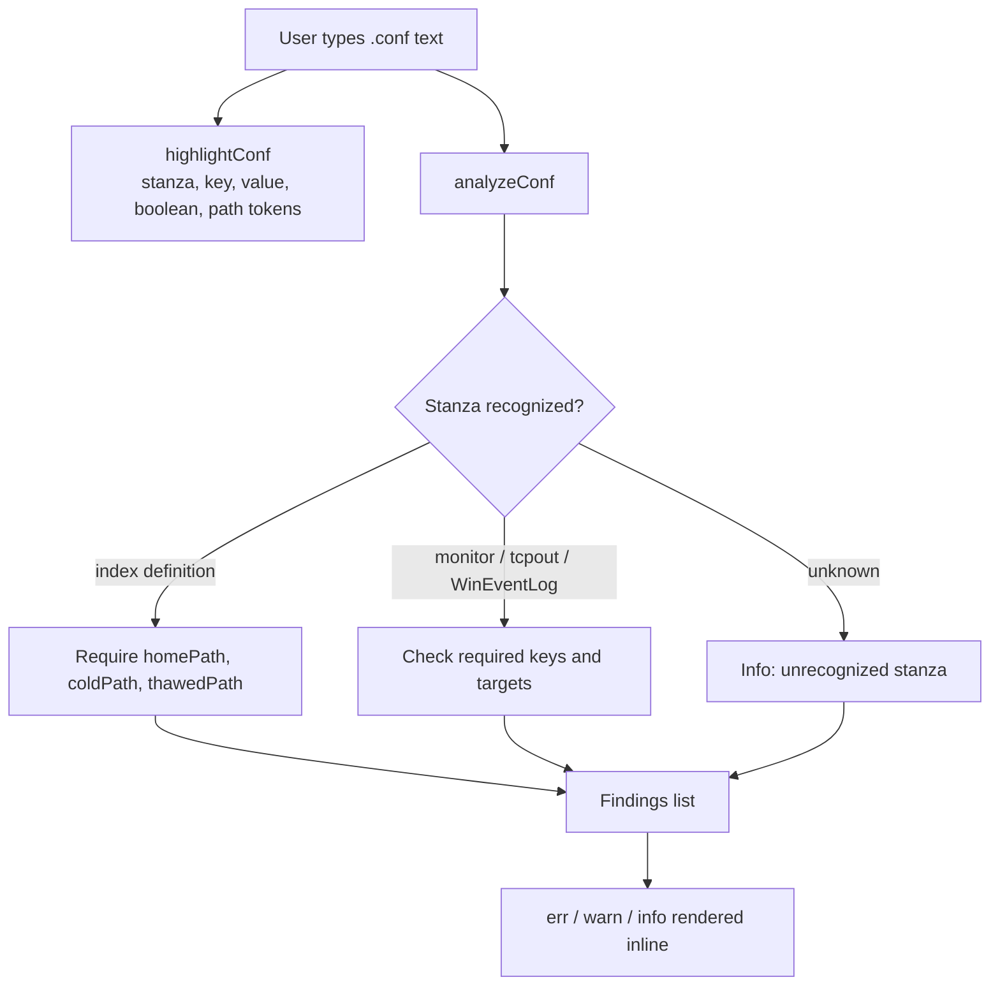
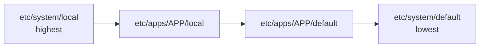
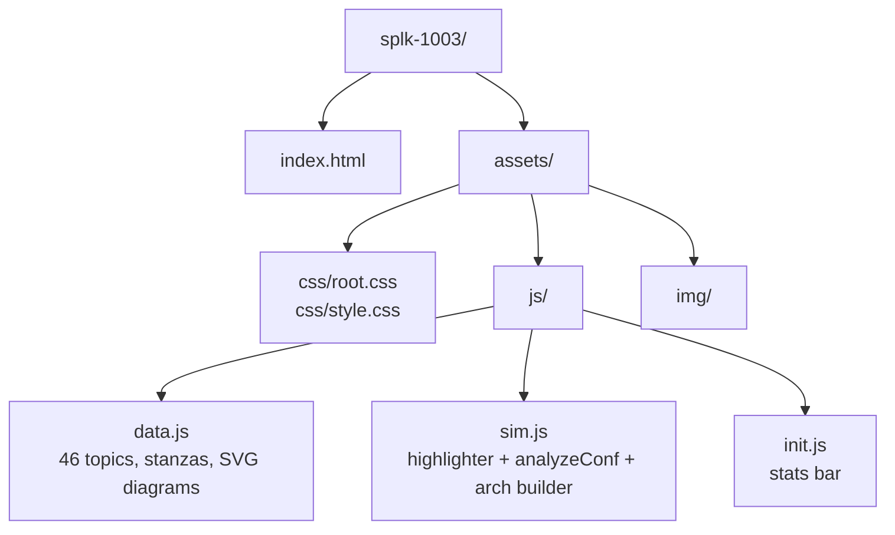

# splk-1003 : Splunk Admin Quick Reference

Interactive architecture and configuration reference for the **SPLK-1003 Splunk Enterprise Certified Admin** exam.

## Project Purpose

The Admin exam is not about SPL. It is about knowing which component does what, which `.conf` file controls it, which stanza belongs where, and what happens when two config layers disagree. That knowledge is normally earned by building a distributed deployment, which most candidates cannot do.

This project rebuilds the deployment as a browsable model. Each of the 46 topics is one layer of the full Splunk architecture, presented with a rendered SVG topology diagram, the real stanzas that configure it, the ports it uses, and the exam facts attached to it. A built in **configuration editor** lets you type `.conf` content and get it syntax highlighted and validated against Splunk rules, so a missing `coldPath` or a bad `[tcpout]` group is flagged immediately.

| Role | What it does |
| :--- | :--- |
| Architecture map | 46 topics ordered as a build sequence from endpoint agent to full cluster |
| Config reference | Real stanzas for inputs, outputs, props, transforms, indexes, server, authentication |
| Validator | `analyzeConf` parses typed configuration and reports errors, warnings, and detected stanza types |
| Exam trainer | Per topic tips, option matrices, and a critical facts sheet |

## Architecture Modeled



## Topic Categories

| Category | Coverage |
| :--- | :--- |
| Core Components | Universal Forwarder, Heavy Forwarder, Indexer, Search Head, Deployment Server, Cluster Manager |
| Data Ingestion | HEC, monitor inputs, wildcards, scripted inputs, Windows inputs, load balancing, indexer acknowledgement, metadata fields |
| Config Files | inputs, outputs, props, transforms, server, web, limits, config layering, precedence in all contexts, btool, the conf file matrix |
| Storage and Indexes | indexes.conf, bucket lifecycle, built in indexes, fishbucket, index creation reasons |
| Deployment | installation and hardening, data pipeline phases, topologies, operational practices |
| Auth and Users | authentication.conf, LDAP, SAML, RADIUS, Duo, roles and capabilities, apps and add ons |
| Cluster and Distributed | distributed search, knowledge bundles, licensing, monitoring console |

## Configuration Validator



## Config Precedence

The precedence topics model the rule the exam keeps testing: the same setting defined in two places resolves by directory layer, not by file order.



Search time context and index time context resolve differently, and both are covered as separate topics with the global to app to user ordering laid out.

## File Layout



| Path | Contents |
| :--- | :--- |
| `assets/js/data.js` | Topic knowledge base: descriptions, inline SVG topology per topic, stanzas, options, exam tips, presets |
| `assets/js/sim.js` | Config syntax highlighter, validator, full architecture diagram builder, sidebar, live `splunkd.log` feed |
| `assets/js/init.js` | Builds the header stats bar from the topic data |

## Running It

Static site. No build step and no dependencies.

```bash
git clone https://github.com/qays3/Splunk-Practice.git
cd Splunk-Practice/splk-1003
python3 -m http.server 8080
```

Then open `http://localhost:8080`. Opening `index.html` directly from disk also works.

## Course Notes

The **Course Notes** button opens the full written Enterprise Admin course, published at:

https://qayssarayra.com/vault/post/splunk-enterprise-admin-course

The notes run from architecture through licensing and detection engineering, and every stanza in them can be pasted into the config editor here.

## Related

`../splk-1002` is the Power User counterpart, an SPL reference with a working client side query engine.

## Repository

https://github.com/qays3/Splunk-Practice
